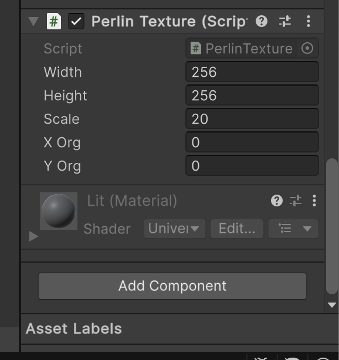
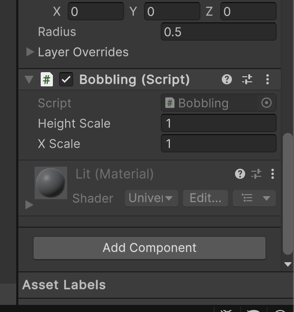
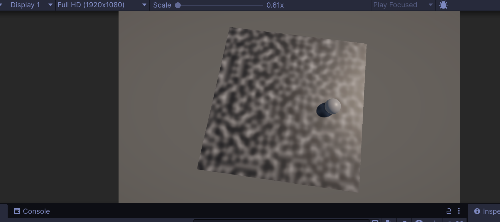

# TD 2 – Bruit de Perlin intégré à Unity

---

## Objectif du TD

L’objectif de ce TD est de découvrir et manipuler le **bruit de Perlin** fourni par Unity afin de :

* Générer une **texture procédurale 2D** à l’aide du bruit de Perlin
* Utiliser le bruit de Perlin comme un **signal 1D** pour animer un objet de manière naturelle

Unity met à disposition la fonction :

```csharp
Mathf.PerlinNoise(float x, float y)
```

qui permet d’échantillonner un plan 2D de bruit de Perlin infini et continu.

---

## Partie 1 – Génération d’une texture de bruit de Perlin

### Script : `PerlinTexture.cs`
```
csharp
using UnityEngine;

public class PerlinTexture : MonoBehaviour
{
    public int width = 256;
    public int height = 256;
    public float scale = 20.0f;
    public float xOrg = 0.0f;
    public float yOrg = 0.0f;

    private Texture2D noiseTex;
    private Color[] pix;

    void Start()
    {
        noiseTex = new Texture2D(width, height);
        pix = new Color[noiseTex.width * noiseTex.height];
        GetComponent<Renderer>().material.mainTexture = noiseTex;
        CalculateNoise();
    }

    void CalculateNoise()
    {
        for (float y = 0.0f; y < noiseTex.height; y++)
        {
            for (float x = 0.0f; x < noiseTex.width; x++)
            {
                float xCoord = xOrg + x / noiseTex.width * scale;
                float yCoord = yOrg + y / noiseTex.height * scale;
                float value = Mathf.PerlinNoise(xCoord, yCoord);
                pix[(int)y * noiseTex.width + (int)x] = new Color(value, value, value);
            }
        }

        noiseTex.SetPixels(pix);
        noiseTex.Apply();
    }
}
```
Ce script, appliqué à un plan, permet de générer dynamiquement une **texture en niveaux de gris** basée sur le bruit de Perlin et de l’appliquer au matériau d’un objet.

### Variables principales

* `width`, `height` : dimensions de la texture générée
* `scale` : contrôle le zoom du bruit de Perlin (plus la valeur est grande, plus le bruit est étiré)
* `xOrg`, `yOrg` : décalage dans le plan de bruit de Perlin
* `noiseTex` : texture générée
* `pix` : tableau de pixels stockant les couleurs

### Capture d’écran


### Fonctionnement du code

1. **Initialisation (`Start`)**

   * Création d’une `Texture2D`
   * Allocation du tableau de pixels
   * Application de la texture au matériau de l’objet

2. **Calcul du bruit (`CalculateNoise`)**

   * Parcours de chaque pixel de la texture
   * Conversion des coordonnées pixel → coordonnées du bruit de Perlin
   * Récupération de la valeur avec `Mathf.PerlinNoise`
   * Conversion de cette valeur en niveau de gris (`Color(value, value, value)`)

3. **Application de la texture**

   * Envoi des pixels à la carte graphique avec `SetPixels`
   * Validation avec `Apply()`

### Capture d’écran


---

## Partie 2 – Animation d’un objet avec le bruit de Perlin

### Script : `Bobbling.cs`

```
csharp
using UnityEngine;

public class Bobbling : MonoBehaviour
{
    public float heightScale = 1.0f;
    public float xScale = 1.0f;

    void Update()
    {
        float height = heightScale * Mathf.PerlinNoise(Time.time * xScale, 0.0f);
        Vector3 pos = transform.position;
        pos.y = height;
        transform.position = pos;
    }
}
```

Ce script, appliuqé à une sphère utilise le bruit de Perlin 2D comme un **bruit 1D** afin de simuler un mouvement de flottement vertical naturel (effet de "bobbling").

### Variables principales

* `heightScale` : amplitude du mouvement vertical
* `xScale` : vitesse de déplacement dans le plan de Perlin

### Capture d’écran


### Fonctionnement du code

* À chaque frame (`Update`) :

  * La coordonnée X du bruit évolue avec le temps (`Time.time * xScale`)
  * La coordonnée Y est fixée à `0.0f`
  * La valeur du bruit est utilisée pour définir la position Y de l’objet

### Animation


---

## Conclusion

Ce TD montre deux utilisations fondamentales du bruit de Perlin dans Unity :

* La **génération procédurale de textures**
* L’**animation naturelle d’objets** sans mouvements répétitifs

Le bruit de Perlin est une base essentielle pour des techniques plus avancées comme :

* La génération de terrains
* Les animations procédurales
* La génération de niveaux (grottes, îles, mondes)

Ce travail constitue une première étape vers la **génération procédurale de contenu** dans les jeux vidéo.

---

