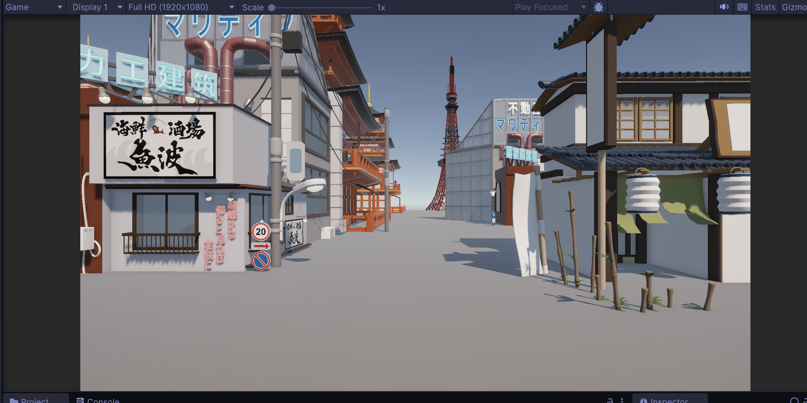
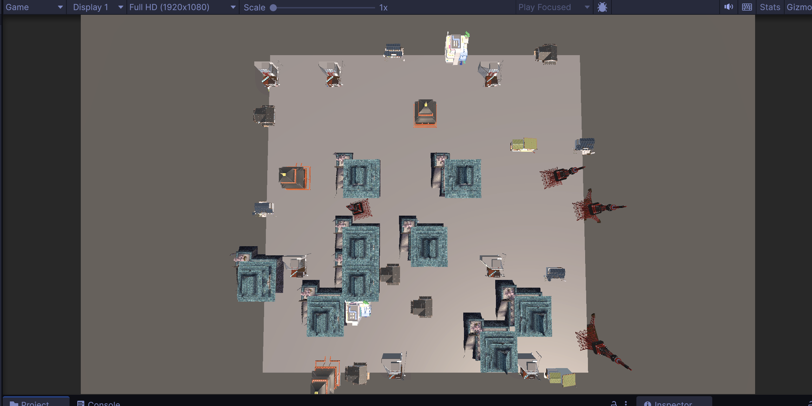
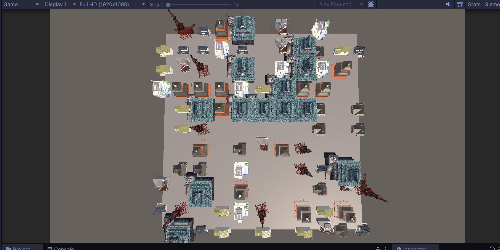
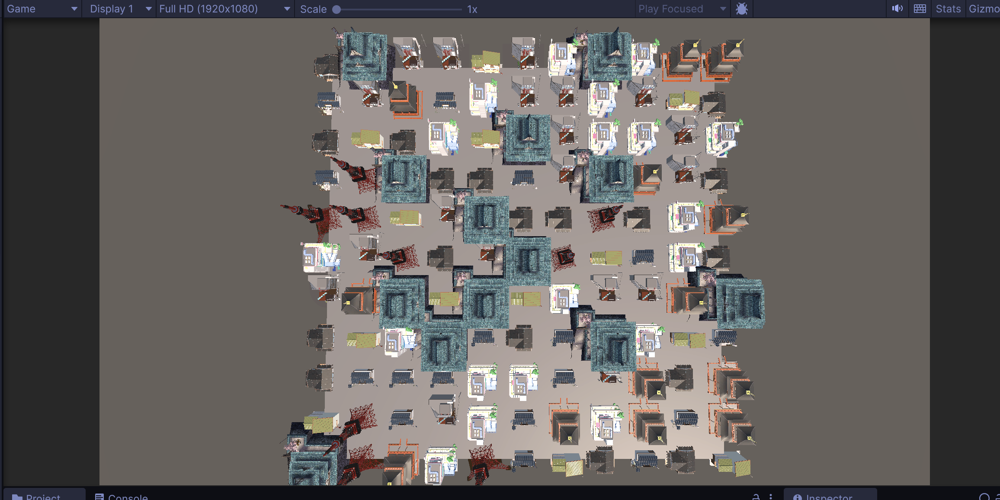
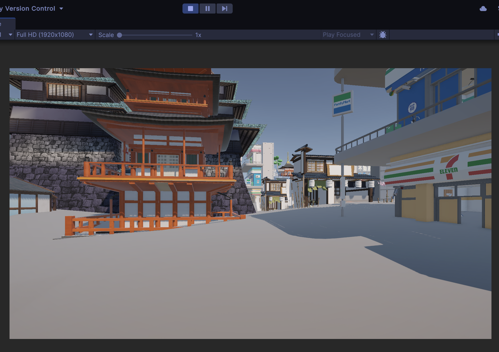
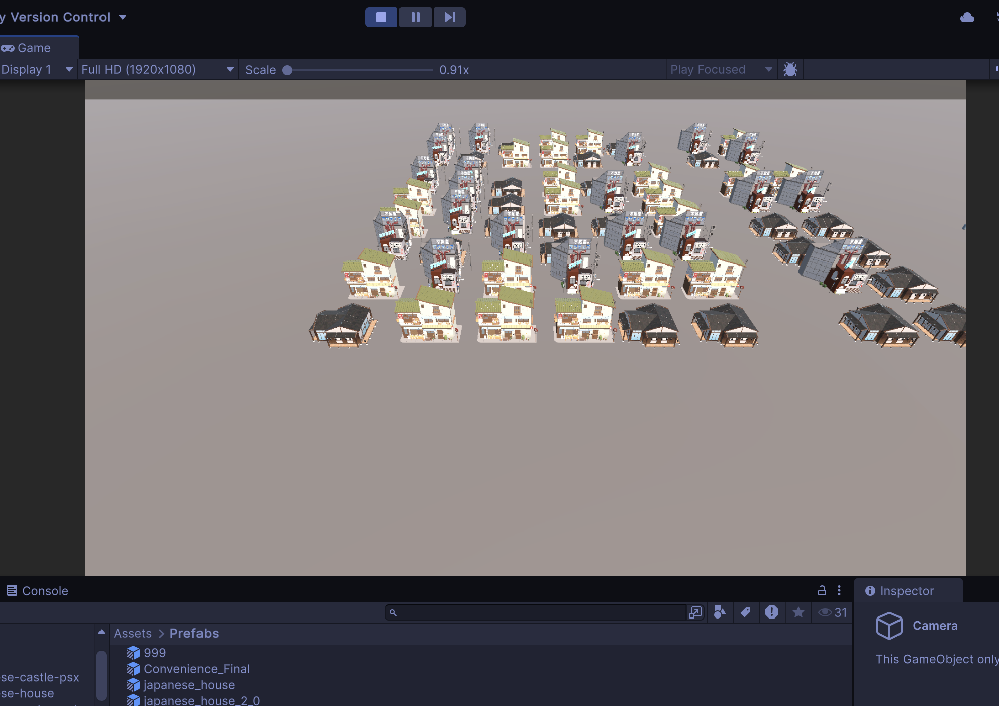
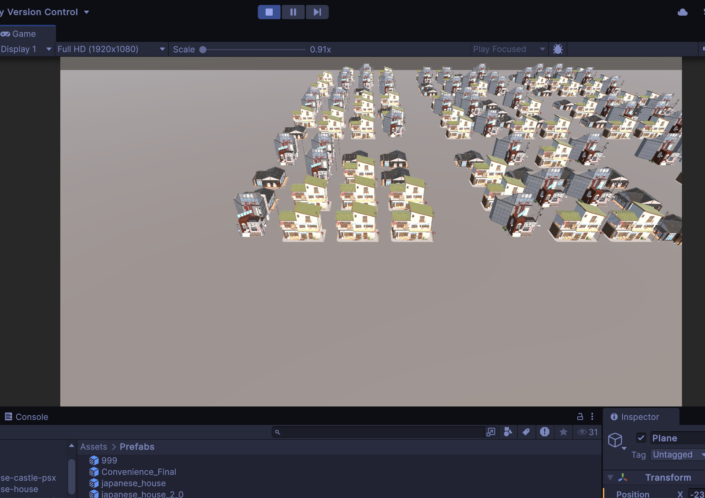

# TD3 : Génération procédurale de villes

## Présentation générale

Ce projet explore la **génération procédurale de villes dans les jeux vidéo**, en utilisant le **bruit de Perlin** afin de créer :
- Une distribution crédible des bâtiments
- Des variations de densité urbaine
- Une altitude de terrain réaliste
- Une optimisation des performances pour des scènes denses

L’implémentation est réalisée sous **Unity (C#)** et s’appuie sur l’état de l’art en génération procédurale.

---

## 🛠️ Technologies utilisées

- Unity
- C#
- Bruit de Perlin
- Prefabs modulaires
- Mesh + vertices

---

## 1. Principes de base

### 1.1 Théorique
La **génération procédurale de villes** consiste à créer automatiquement des environnements urbains à partir d’algorithmes plutôt que de tout modéliser à la main.  
L’objectif est d’obtenir des villes **variées, rejouables et cohérentes**, tout en réduisant le temps de production.

Les approches les plus courantes incluent :
- **Le bruit de Perlin / Simplex** pour la densité ou la répartition des bâtiments. Génère des valeurs continues pour répartir densité, hauteur, ou type de bâtiment. (Minecraft, No Man's Sky)
- **Les grammaires de forme** pour définir la structure des bâtiments. Règles de construction automatique de bâtiments. (CityEngine)
- **Les graphes routiers** ou **L-systems** pour générer un réseau de routes logique. (Jeux de stratégie)
- **Les systèmes en tuiles (Tile-based)** pour assembler des zones modulaires. (Cities: Skylines)
- **Les méthodes à base d’agents** (simulations d’urbanistes) pour poser routes et zones en suivant des règles. (SimCity)

Ces méthodes sont largement utilisées dans les jeux de type **sandbox** et **open-world**.

---

### 1.2 Pratique (Bruit de Perlin) 

**Objectif :** générer une petite ville en utilisant le **bruit de Perlin**.
Un mesh sert de surface de base. Chaque sommet est évalué via le bruit de Perlin. La valeur obtenue influence la présence et le type de bâtiment.

densityFactor : Contrôle la densité globale de la ville 
buildings[]	: Liste des modèles de bâtiments disponibles
scalex, scalez	: Échelle appliquée au maillage pour ajuster la taille de la ville
Perlin surface : Génère les variations de placement des bâtiments

#### Script C# 
```csharp
using System.Collections;
using System.Collections.Generic;
using UnityEngine;

public class MakeCity : MonoBehaviour
{
    public GameObject[] buildings;
    [Header("Densité")]
    public float densityFactor = 0.3f; // Réduit le nombre total de bâtiments

    void Start()
    {
        Perlin surface = new Perlin();
        Mesh mesh = GetComponent<MeshFilter>().mesh;
        Vector3[] vertices = mesh.vertices;
        float scalex = transform.localScale.x;
        float scalez = transform.localScale.z;

        for (int v = 0; v < vertices.Length; v++)
        {
            // Appliquer un facteur de densité
            if (Random.value > densityFactor) continue;

            float perlinValue = surface.Noise(
                vertices[v].x * 2 + 0.1365143f,
                vertices[v].z * 2 + 1.21688f) * 10;

            perlinValue = Mathf.Clamp(perlinValue, 0, buildings.Length - 1);

            // Utiliser la partie décimale pour plus de variété
            int buildingIndex = Random.Range(0, buildings.Length);

            Instantiate(buildings[buildingIndex],
               new Vector3(vertices[v].x * scalex, vertices[v].y, vertices[v].z * scalez),
               buildings[buildingIndex].transform.rotation);
        }

        mesh.RecalculateBounds();
        mesh.RecalculateNormals();
        gameObject.AddComponent<MeshCollider>();
    }
}
```
Ce script implémente une génération procédurale de ville dans Unity en instanciant automatiquement des bâtiments sur la surface d’un mesh à partir du bruit de Perlin. Chaque sommet du plan est considéré comme un emplacement potentiel, mais un facteur de densité (`densityFactor`) est appliqué afin de contrôler le nombre total de bâtiments générés et d’éviter une surcharge visuelle. Le bruit de Perlin est utilisé pour assurer une répartition spatiale cohérente et naturelle des structures, en évitant une distribution totalement aléatoire. La sélection des bâtiments se fait à partir d’un tableau de préfabriqués, ce qui permet d’introduire de la variété architecturale tout en restant adaptable à n’importe quel nombre de modèles. Enfin, le script recalcule les propriétés du mesh et ajoute un `MeshCollider` afin de permettre les interactions physiques et la navigation dans l’environnement urbain généré.

Dans le script proposé, plusieurs paramètres peuvent être ajustés afin de contrôler la densité urbaine et la variété des bâtiments générés. Le paramètre principal de densité est densityFactor, qui définit la probabilité d’apparition d’un bâtiment sur un sommet du mesh. Une valeur faible produit une ville clairsemée, tandis qu’une valeur élevée génère une zone urbaine plus dense. La densité peut également être influencée indirectement par l’échelle du bruit de Perlin (multiplicateurs appliqués aux coordonnées), qui détermine la taille et la continuité des zones construites.
La variété des structures dépend principalement du tableau buildings, qui contient les différents préfabriqués de bâtiments. Plus ce tableau est grand et diversifié, plus la ville générée présentera de variations architecturales. Le choix aléatoire du bâtiment (Random.Range) permet d’éviter la répétition visuelle, tandis que le bruit de Perlin peut être utilisé pour associer certains types de bâtiments à des zones spécifiques (par exemple, petits bâtiments en périphérie et immeubles en centre-ville).

Pour chaque sommet du mesh :
    Calculer la valeur de bruit de Perlin (noiseValue)

    Si noiseValue < seuil_densité :
        Ne pas générer de bâtiment
    Sinon :
        Si noiseValue est faible :
            Choisir un bâtiment résidentiel
        Sinon si noiseValue est moyen :
            Choisir un immeuble
        Sinon :
            Choisir un gratte-ciel

        Instancier le bâtiment à la position du sommet
        
📸 **Capture – Variation de densité urbaine**

- __Vue première personne :__



- __Vue du dessus__

> Densité de 0.3



> Densité de 0.5



> Densité de 0.7


---

# 2. Intérêt de la génération procédurale de villes et l'application du bruit de Perlin

## 2.1 Théorie

La génération procédurale permet :

* Une **réduction du temps de production**
* Une **diminution de l’espace mémoire**
* Une **variété quasi infinie**
* Une **meilleure rejouabilité**

Les systèmes les plus impactés positivement sont :

* Les mondes ouverts
* Les jeux d’exploration
* Les simulations urbaines

La génération procédurale de villes constitue une approche particulièrement avantageuse dans le développement de jeux vidéo, car elle permet de créer des environnements vastes, variés et crédibles à moindre coût de production. Contrairement à une conception entièrement manuelle, la génération procédurale réduit considérablement le temps de création des niveaux tout en offrant une forte rejouabilité. Chaque exécution du système peut produire une ville différente, ce qui renouvelle l’expérience du joueur sans nécessiter de nouveaux assets.
L’utilisation du bruit de Perlin est particulièrement adaptée à cette approche, car il génère des variations continues et naturelles, contrairement à un bruit purement aléatoire. Cela permet d’obtenir des structures urbaines cohérentes, avec des transitions progressives entre les zones denses et les zones peu construites. Le bruit de Perlin est ainsi largement utilisé pour simuler des phénomènes naturels ou réalistes tels que la topographie, la densité urbaine ou la répartition des quartiers.
Les aspects de la création de jeu qui bénéficient le plus de cette approche sont la conception des niveaux (level design), l’optimisation des ressources (mémoire et stockage), la rejouabilité, ainsi que l’immersion du joueur. En combinant génération procédurale et bruit de Perlin, les développeurs peuvent créer des mondes ouverts crédibles, dynamiques et adaptés aux contraintes techniques des jeux modernes.

---

## 2.2 Pratique – Variation de l’altitude des terrains urbains

### Technique proposée

* Utilisation de plusieurs **octaves de Perlin**
* Combinaison amplitude / fréquence
* Hauteur maximale contrôlée

### Script C# – Altitude procédurale optimisée

```csharp
On utilise la fonction GetHeight sur la composante :
vertices[v].y ;
mesh.vertices = vertices;

float GetHeight(float x, float z)
{
    float height = 0f;
    float amplitude = 1f;
    float frequency = 1f;

    for (int i = 0; i < 4; i++)
    {
        height += Mathf.PerlinNoise(
            x * 0.05f * frequency,
            z * 0.05f * frequency
        ) * amplitude;

        amplitude *= 0.5f;
        frequency *= 2f;
    }

    return height * 10f;
}
```
**1. Perlin Noise**
Mathf.PerlinNoise(x, z) renvoie une valeur entre 0 et 1.
On l’utilise pour générer des "bosses" et "creux" naturels, pas totalement aléatoires mais fluides.
**2. Octaves**
On additionne plusieurs couches de bruit (4 ici).
Chaque octave a une fréquence plus élevée et une amplitude plus faible → ça crée du détail à différentes échelles, comme des collines grandes + petites ondulations.
**3. Amplitude**
Contrôle la force de chaque octave.
On la divise par 2 à chaque octave pour que les petites ondulations aient moins d’impact que les grandes.
**Frequency**
Contrôle combien de "vagues" apparaissent sur le terrain.
On double à chaque octave pour ajouter des détails plus fins.
**Multiplication finale**
height * 10f → on ajuste l’échelle de la hauteur pour que les bosses et creux soient visibles sur le plan Unity.

### Apports au gameplay

* Quartiers en hauteur
* Points d’observation
* Variété visuelle
* Navigation plus intéressante

📸 **Capture – Variation de l'altitude urbaine**




---

# 3. Réalisme dans la génération procédurale de villes

## 3.1 Théorie


La génération procédurale permet de créer rapidement des environnements urbains vastes et variés, mais elle ne garantit pas toujours le réalisme. Plusieurs défis apparaissent :

### Organisation spatiale cohérente
Les villes réelles suivent des règles implicites : zones résidentielles, commerciales, industrielles, infrastructures routières, etc.
Les algorithmes procéduraux doivent intégrer des contraintes de zonage pour éviter des quartiers incohérents (ex : une usine au milieu d’une zone pavillonnaire).

### Variation naturelle des bâtiments et de l’environnement
Une ville réaliste ne contient pas des bâtiments parfaitement alignés ou identiques.
Il faut gérer : hauteur, style architectural, densité, orientation, matériaux.
Les octaves de bruit (Perlin, Simplex, etc.) peuvent aider à créer des variations naturelles.

### Échelle et proportions réalistes
Routes, trottoirs, distances entre bâtiments et parcs doivent être proportionnées.
L’absence de respect de ces proportions rend rapidement la ville irréaliste, même si les bâtiments sont variés.

Sans règles supplémentaires, les villes peuvent sembler chaotiques.

---

## 3.2 Pratique – Amélioration du réalisme résidentiel

### Fonctionnalité proposée : Quartiers résidentiels cohérents

Contrairement à une génération totalement aléatoire, cette approche vise à produire des quartiers structurés, lisibles et cohérents, similaires à des zones pavillonnaires réelles.

Le réalisme repose sur trois principes fondamentaux :
### Bruit de basse fréquence pour définir des zones
La génération s’effectue sur une grille régulière, ce qui permet d’obtenir des zones homogènes et organisées, évitant une disposition chaotique des bâtiments.

### Limitation de hauteur
Seuls des bâtiments résidentiels de taille modérée sont utilisés, garantissant une cohérence architecturale propre aux quartiers d’habitation.

### Espacement régulier et présence de rues
Les bâtiments sont espacés de manière constante et des rues sont intégrées périodiquement afin de structurer l’espace urbain.


### Script C# – Zones résidentielles
```csharp
using System.Collections;
using System.Collections.Generic;
using UnityEngine;

public class ResidentialNeighborhood : MonoBehaviour
{
    [Header("Bâtiments résidentiels")]
    public GameObject[] residentialBuildings;

    [Header("Paramètres du quartier")]
    public int gridWidth = 10;    // Nombre de cases en X
    public int gridHeight = 10;   // Nombre de cases en Z
    public float buildingSpacing = 20f; // Distance entre bâtiments
    public int streetInterval = 7; // Une rue tous les N bâtiments

    void Start()
    {
        GenerateNeighborhood();
    }

    void GenerateNeighborhood()
    {
        for (int x = 0; x < gridWidth; x++)
        {
            for (int z = 0; z < gridHeight; z++)
            {
                // Créer des rues tous les streetInterval bâtiments
                if (x % streetInterval == 0 || z % streetInterval == 0)
                    continue;

                // Choisir un bâtiment résidentiel aléatoire
                int buildingIndex = Random.Range(0, residentialBuildings.Length);

                // Calculer la position dans le monde
                float posX = transform.position.x + x * buildingSpacing;
                float posZ = transform.position.z + z * buildingSpacing;
                float posY = transform.position.y;

                Instantiate(residentialBuildings[buildingIndex],
                    new Vector3(posX, posY, posZ), residentialBuildings[buildingIndex].transform.rotation);
            }
        }
    }
}
```

Le quartier est généré à partir d’une grille régulière (gridWidth, gridHeight), ce qui garantit une disposition ordonnée des habitations. Cette structure reproduit les quartiers résidentiels modernes, souvent organisés selon des axes orthogonaux. Le paramètre buildingSpacing définit une distance constante entre les maisons. Cela permet de simuler des trottoirs. La condition introduit des rues régulières dans le quartier. Ces lignes vides structurent l’espace et évitent l’effet de « bloc compact », renforçant ainsi la lisibilité urbaine. Même si la structure est régulière, une variation légère est conservée grâce au choix aléatoire des bâtiments résidentiels, évitant la répétition excessive tout en maintenant une cohérence architecturale.

### Apports au gameplay

* Quartiers résidentiels structurés et crédibles
* une séparation claire entre habitations et rues
* une cohérence architecturale réaliste

📸 **Capture – Quartier résidentiel généré**

Voici le résultat avec les paramètres suivants : 
```
    - gridWidth = 20
    - gridHeight = 20
    - buildingSpacing = 10
    - streetInterval = 4
```


On constate qu'il y a bien deux quartiers, séparé par une ruelle, les batiments sont espacés entre eux donnant cette impression de quartier.

Autre expérimentation avec des paramètres différents : 
```
    - gridWidth = 15
    - gridHeight = 15
    - buildingSpacing = 20
    - streetInterval = 5
```

On a des quartiers plus prononcés, on les distingue mieux.


---

# 4. Génération procédurale et optimisation de la latence

## 4.1 Théorie

### Jeux utilisant la génération procédurale

* Minecraft : En mode survie avec mods urbains ou certaines versions personnalisées, des villes peuvent être générées automatiquement sur le terrain.
* Cities: Skylines : Utilise des outils procéduraux pour générer des routes, des quartiers, et des bâtiments avec des extensions et des mods dédiés.
* No Man’s Sky : Génère des planètes, plantes, animaux, mais aussi structures et villes extraterrestres procédurales à la volée.
* SimCity 

### Problèmes rencontrés

* Volume de données élevé : Des milliers de bâtiments, routes, objets et textures doivent être chargés et instanciés, ce qui peut provoquer des pics de latence lorsqu’on génère ou met à jour trop d’éléments simultanément.
* Calculs coûteux (en calcul CPU)
* Chargement en temps réel : Si un joueur se déplace rapidement dans une grande ville, générer dynamiquement les zones proches et détruire celles qui s’éloignent doit se faire sans interruption visible.
* Chute de FPS en zones denses 

---

## 4.2 Pratique – Optimisation des performances

### Stratégies utilisées pour optimiser la performance et réduire la latence

* Chargement asynchrone
Les opérations de génération de bâtiments, routes, terrains ou zones doivent être effectuées hors du thread principal de rendu.
Utiliser des threads ou des tâches en arrière-plan pour calculer les données avant de les envoyer au moteur.
Unity : via JobSystem, Burst, ou Task.Run pour découpler les calculs coûteux du rendu.
**Cela empêche les pics de latence visibles à l’écran.**

* Level of Detail (LOD)
Dans une ville dense, on ne rend pas tous les objets de la même manière selon la distance au joueur.
LOD : utiliser des modèles simplifiés pour les bâtiments éloignés.
* Distance Culling : ne pas afficher les objets trop éloignés.
* Occlusion Culling : ne pas dessiner les objets cachés derrière d’autres (bâtiments, collines, etc.).
**Réduit l’utilisation GPU et améliore la fluidité.**

* Streaming de zones
Au lieu de charger toute la ville d’un coup, on segmente le monde en blocs ou cellules (grid / chunks).
On génère et active dynamiquement les zones proches du joueur.
On désactive ou détruit celles qui s’éloignent.
Cela ressemble à ce que font les jeux ouverts (open world) comme The Witcher 3 ou Horizon Zero Dawn
**Réduit les ressources actives en mémoire à tout instant.**

---

### Conclusion
Générer des villes procédurales réalistes est un défi à la fois conceptuel et technique.
Au-delà des algorithmes de création, l’optimisation de la latence est essentielle pour garantir une expérience fluide.

---
