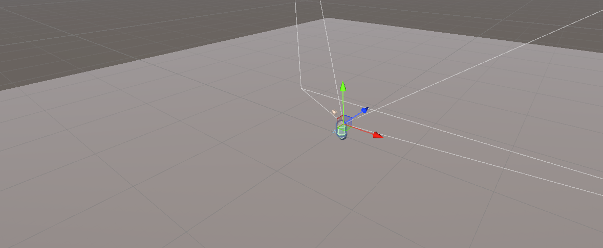
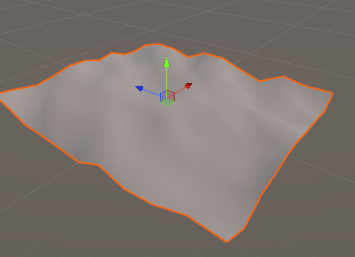
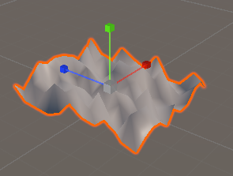
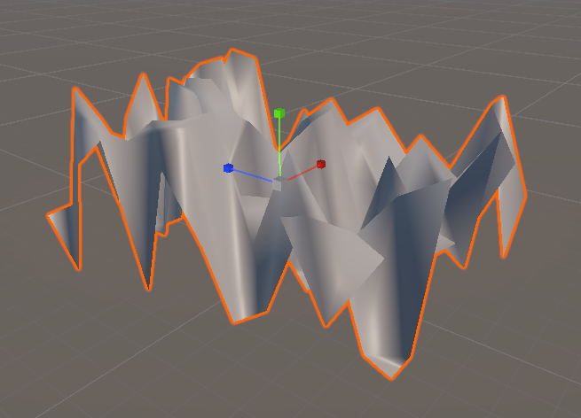
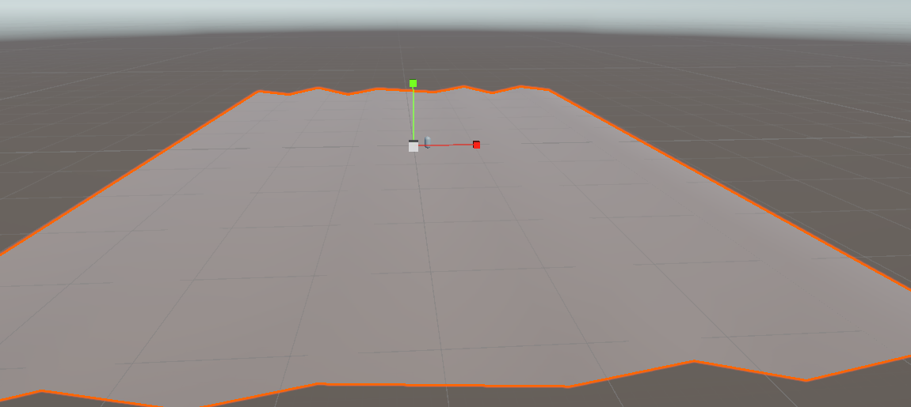
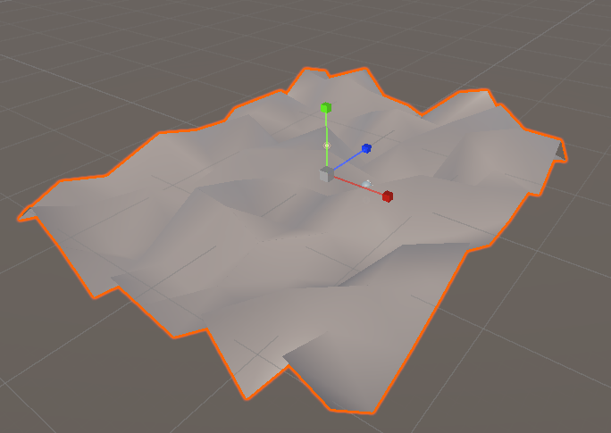
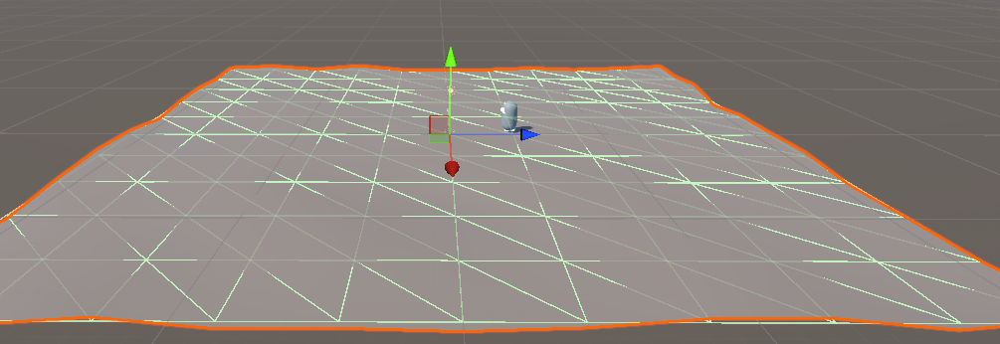
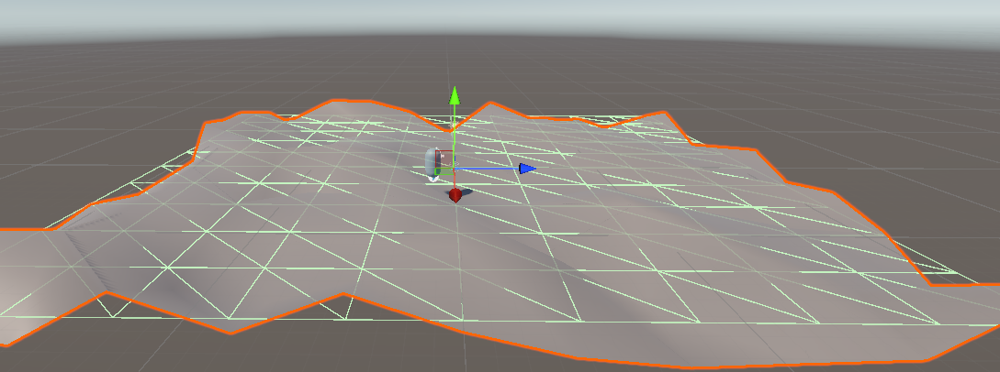
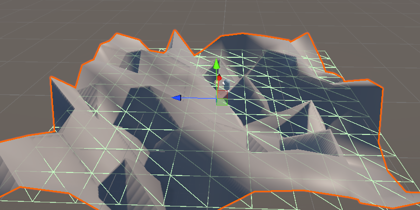

# Chapitre 3 - TD2

## Préambule

> L'objectif de ce TD est de généré des terrains de façons procédurale, en considérant plusieurs modes de génération aléatoire, à savoir : génération en Random Normal, génération sinusoîdale et enfin génération avec le bruit de perlin. Nous allons essayer ces méthodes de génération et discuter des limitations associées à ces dernières.

## Sommaire
    - []


## Mise en place de l'environnement

Ce TD a été réalisé sur Unity, en utilisant le Starter Pack Universal 3D (URP). On créé le projet comme suit : 


## FPC

Pour ce TD, nous avons besoin du package Character Controller, que nous avons installé ici : [Lien](https://assetstore.unity.com/packages/essentials/starter-assets-firstperson-updates-in-new-charactercontroller-pa-196525?srsltid=AfmBOoqvNIRA5QBDdJQcvQ8Ecdhu7jkbYuE9hB__xWQlxcmGNfAtdugT), étant donné que le FPC (First Person Controller) n'était pas présent dans la machine où le TD a été réalisé.

## Le Player Controller

On créé une capsule, on lui attache le Character Controller ainsi qu'une caméra, on le place en (0,1,0) 

## Le terrain

On créé un terrain qu'on pose au pied de la capsule, et on retire le MeshCollider car c'est le script qui va s'en chargé une fois qu'il aura re calculé les normales avec notre mode de génération.

## Screenshot de l'environnement



## Génération aléatoire avec Random.Range

L'idée est de créé un script qui va se charger de calculer les normales du plan qu'on a placé sur la scène. Pour ce faire, on va associé le script MakeTerrain.cs au plan, et on va lui ajouté ce script : 

```c#
using System.Collections;
using System.Collections.Generic;
using UnityEngine;
public class MakeTerrain : MonoBehaviour
{
    void Start()
    {
        Mesh mesh = this.GetComponent<MeshFilter>().mesh;
        Vector3[] vertices = mesh.vertices;
        for (int v = 0; v < vertices.Length; v++)
        {
            vertices[v].y = Random.Range(0f, 10f);
        }
        mesh.vertices = vertices;
        mesh.RecalculateBounds();
        mesh.RecalculateNormals();
        this.gameObject.AddComponent<MeshCollider>();
    }
}

```

### Explication du code
On a besoin du composant "MeshFilter" de notre plan, afin d'avoir accès a ses vertices, pour pouvoir les redimentionnées à notre guise. On itère sur chaque vertex en partant de la copie de l'ensemble des vertex du mesh original et on lui donne une valeur entre 0 et 10 (flottant). Enfin, on change les anciens vertexs du plan avec les nouveaux calculés, et on recalcul le volume englobant (qui est utile pour la détection de collision) et on recalcule les normales (qui sont utiles pour les ombres). 
N.B : Le MeshCollider est ajouté en fin de script pour éviter que le PFC ne tombe lors de la génération du terrain. Aussi, on place le PFC en auteur sinon après génération, il risque de tombé. Pour fixer les idées, on a placé le PFC en (0,10,0)

## Screenshot de la génération



Ici, on constate que le terrain est plutôt bien généré, mais risque de créé des pentes infranchissables / être trop brute.



Ici, on a réduit le terrain, et on remarque en effet cette limitation



Ici, on a remit le terrain comme initialement, mais en générant des normales entre 0 et 50, et on constate en effet que c'est très vite erratique et impratiquable.


## Conclusion

On constate qu'on a un terrain généré aléatoirement, mais il contient des limitations à cause du fait qu'on utilise Random.Range(x,y), et que cela génère des pentes / montées trop raides. Il nous faudrait donc une méthode qui permet de généré des surfaces plus lisses.

## Génération aléatoire avec sinus

On modifie le code précédent, mais au lieu d'utiliser Random.Range, on utilise Mathf.sin, qui va nous généré une surface plus courbée et continue due à la nature de la fonction sinus qui est cyclique.

```c#
for (int v = 0; v < vertices. Length; v++)
{
vertices[v].y = Mathf. Sin(vertices[v].x * 10);
}
```

Ici, on utilise la composante en x qu'on multiplie par 10 pour faire varié la composante en y du vertex considéré.

## Screenshot de la génération



On constate ici qu'on a des surfaces plus lisses, mais trop régulières et pas naturelles.

## Conclusion

On constate qu'on a maintenant un terrain plus lisse, mais on a perdu l'aspect aléatoire de la génération précédente.

## Génération avec le bruit de perlin

On peut utiliser le bruit de perlin afin de généré un terrain. En effet, chaque gradient est plus lisse entre 2 points, ce qui créé des surfaces plus logiques, un peu comme des sortes de montagnes.

Pour ce faire, on utilise le fichier PerlinNoise.cs fournit dans le sujet du TD, et on modifie le script MakeTerrain comme suit : 
```c#
Perlin surface = new Perlin();
...
for (int v = 0; v < vertices.Length; v++)
{
vertices[v].y = surface.Noise(
vertices[v].x * 2 + 0.1365143f,
vertices[v].z * 2 + 1.21688f) * 10;
}
...
```

On utilise le script Perlin pour utiliser sa fonction Noise, qui génère le bruit de perlin (composé de pixels noir et blanc), on a la couleur noir qui indique une altitude la plus basse et la couleur blanche qui représente l'altitude la plus élevée. Les nuances de gris permettent de généré les gradients. C'est pour cela qu'ici, on peut modifié les coordonnées x, y et z ce qui génère un terrain plus naturel.

## Screenshot de la génération




## Conclusion

A l'aide du bruit de perlin, nous sommes parvenus à générer un terrain naturel à partir des gradients qu'il génère. En adaptant notre génération précédente, nous sommes parvenus à concilié uniformité et randomness dans une même méthode. Cette méthode peut être répliquée dans la génération de montagnes par exemple.

## Réponses aux questions

### Génération procédurale d'un terrain

#### Théorique


Expliquez le principe de la génération procédurale de terrains dans les environnements 3D.
Comment les algorithmes de génération procédurale contribuent-ils à la diversité et à
l'immersion des mondes virtuels ?

Le principe de génération procédurale de terrains dans les environnements 3D est le principe de partir d'un plan 2D comme nous avons fait, et de lui appliquer un ou des algorithmes de génération procédurale pour lui donner sa forme 3D. Ces algorithmes se basent sur des mathématiques qui permettent de tout modéliser à partir des vertices, plutôt que de le faire manuellement. En effet, ces algorithmes agissent sur la grille de points, pour les faire déplacer dans l'espace afin de créé des pentes / montées. Chaque point reçoit une valeur pour faire variée son hauteur, ce qui créé les reliefs présents dans la majeure partie des environnements que l'on voit dans les jeux vidéos actuels.

Ces algorithmes contribuent à la diversité dans les mondes virtuels car ils permettent des générations plus abondantes que des générations manuelles, nous proposant des mondes diverses et variés, offrant des possibilitées d'exploration quasi infinies, en modifiant les paramètres de génération, on peut se retrouvé avec un jeu comme Minecraft, où chaque monde est unique et permet d'avoir une immersion optimale dans ce monde virtuel. En effet, on ne sait pas a quoi s'attendre, en fonction de l'algorithme utilisé, on peut avoir des grottes, des terrains avec des formes particulièrement intéressantes. Tout cela contribue à amélioré la richesse des contenus proposés dans un jeu vidéo, offrant plus de gameplay potentiellement car plus d'espace disponible.

#### Pratique

Développez un script simple en utilisant Unity pour générer un terrain procédural basique.
Quelles techniques utilisez-vous pour assurer que chaque génération de terrain reste jouable
et visuellement cohérente ?

Se référé à la partie étape pour plus de détails, mais voici le script poue le terrain procédural basique.
```c#
using System.Collections;
using System.Collections.Generic;
using UnityEngine;
public class MakeTerrain : MonoBehaviour
{
    void Start()
    {
        Mesh mesh = this.GetComponent<MeshFilter>().mesh;
        Vector3[] vertices = mesh.vertices;
        for (int v = 0; v < vertices.Length; v++)
        {
            vertices[v].y = Random.Range(0f, 10f);
        }
        mesh.vertices = vertices;
        mesh.RecalculateBounds();
        mesh.RecalculateNormals();
        this.gameObject.AddComponent<MeshCollider>();
    }
}

```
Pour que chaque génération reste jouable et visuellement cohérente, il faut limiter les variations d'auteurs pour s'assuré sue les pentes / montées ne soient pas trop raides. On peut aussi changer l'échelle du plan 2D de base pour mieux espacé les changements d'hauteurs. Enfin, l'interpolation (cours vu en unité Algèbre avancé) pourrait être une piste intéressante à suivre, pour rendre les pics plus lisse.
Tout cela étant dans la volonté de réalisé un contrôle intelligent du hasard engendré par l'algorithme de génération de terrain, en faisant aussi varié les paramètres pour constaté visuellement d'un terrain cohérent et jouable.

### Application du bruit de Perlin dans la génération procédurale d'un terrain

#### Théorique 

Comment le bruit de Perlin est-il appliqué dans la génération procédurale de terrains, et
quels sont les avantages de cette méthode par rapport aux méthodes traditionnelles de
génération de terrains ?

Le bruit de perlin peut modélisé un terrain car il contient des pixels noir et blanc et des nuances de gris, modélisant les gradients (descentes / montées). Le noir représente une altitude basse tandis que le blanc représente l'altitude maximale. Le bruit de perlin étant un bruit, ces points sont distribués de façon pseudo aléatoire, permettant ainsi de généré un terrain de manière procédurale. Les avantages de cette méthode par rapport aux méthodes traditionnelles est qu'il permet d'obtenir un terrain plus cohérent dû au fait que les pentes sont moins raides et plus espacées. Elle produit en d'autres termes, des gradients plus doux et moins brusques qu'un changement d'altitude brut appliqué à un vertex, il agit sur les trois composantes (x,y,z) d'un point du plan 2D de base (on modifie y à partir des valeurs du plan xOz). Enfin, on a un contrôle plus intéressant qu'une simple valeur d'altitude ou une fonction sinusoîdale a changer. En effet, on peut changé les octaves, la fréquence ou même l'amplitude, ce qui offre une meilleure base pour généré un terrain jouable et visuellement cohérent.

#### Pratique

Implémentez une fonction en C# pour Unity qui génère un terrain en utilisant le bruit de
Perlin. Comment ajustez-vous les paramètres du bruit de Perlin (comme l'amplitude, la
fréquence, et le nombre d'octaves) pour créer différents types de paysages (montagneux,
vallonnés, plats) ?

Le script du bruit de perlin est déjà fournit, voici le script qui permet de généré le bruit de perlin

```c#
using System.Collections;
using System.Collections.Generic;
using UnityEngine;
public class MakeTerrain : MonoBehaviour {
void Start()
{
Perlin surface = new Perlin();
Mesh mesh = this.GetComponent<MeshFilter>().mesh;
Vector3[] vertices = mesh.vertices;
for (int v = 0; v < vertices.Length; v++)
{
vertices[v].y = surface.Noise(
vertices[v].x * 2 + 0.1f,
vertices[v].z * 2 + 1.2f) * 10;
}
mesh.vertices = vertices;
mesh.RecalculateBounds();
mesh.RecalculateNormals();
this.gameObject.AddComponent<MeshCollider>();
}
}

```

Ce script reprend la base du script de base pour généré un terrain procédurale basique, mais on utilise le script Perlin et on modifie la composante y du vertex considéré à partir de ses valeurs x et y.
Paysage plat : fréquence faible, amplitude moyenne / élevée 
(f=1 et A=10)

Paysage vallonnés : fréquence moyenne, amplitude moyenne et octaves 2-4
(f=5 et A=5)

Paysage montagneux : fréquence élevée, fréquence faible / moyenne et octaves 3-6
(f=15 et A=15)


En ce qui concerne le changement d'octaves, on peut estimé à 1-2 octaves pour le paysage plat, 2-4 octaves pour un paysage montagneux et enfin 3-6 octaves pour un paysage montagneux. Jouer sur les octaves nous donnerais un paysage plus intéressant qu'en jouant seulement sur l'amplitude et la fréquence.


### Intérêt de la génération procédurale d’un terrain

#### Théorique

Quels sont les principaux avantages de la génération procédurale de terrains dans le
développement de jeux vidéo et la simulation environnementale ?

Tout d'abord, cela nous offre comme vu précédemment, une diversité quasi infinie, et permettre une rejouabilité et une exploration plus intéressante qu'un terrain plus petit. De plus, en termes de flexibilité, cela permet aux développeurs de généré des terrains à leur guise en jouant sur les paramètres de l'algorithme, permettant pourquoi pas des générations à la volée en plein pendant la session de jeu. Enfin, on peut aussi parler de gain en mémoire et stockage, en effet, dans le cas de minecraft, les terrains ne sont pas stockés en mémoire mais généré à l'aide du bruit de perlin.

#### Pratique

Proposez une méthode pour intégrer la génération procédurale de terrains dans un projet
existant afin d'améliorer l'expérience de jeu sans augmenter significativement les besoins en
ressources. Quelles seraient les étapes et les considérations clés ?

Si on considère notre jeu Omoyiari, le jeu se passe sur une plateforme centrale, on aurait donc besoin d'embellir les alentours pour créer une sensation d'infini inateignable. Pour ce faire, on y intègre des montagnes générées procéduralement tout autour de l'eau qui entoure l'ilôt centrale.

Les étapes seraient de définir le script de génération, dans notre cas nous utiliserions le bruit de perlin. Créer le plan et lui appliquer le script MontainTerrain. Il faudrait paramétrer cet algorithme car les montagnes seraient éloignées, donc elles doivent être en altitude assez élevée pour être visible et que cela imite le mieux un paysage montagneux (donc f=10 A=15 et O=5 par exemple). On doit généré le terrain sur un contour : 


Comme le montre ce schéma, il y aurait un creu, donc il faudrait le prendre en considération, en rendant soit convexe les montagnes sur le côté, ou alors en générant quatres plans différents.


### Gain de temps

#### Théorique

En quoi la génération procédurale de terrains peut-elle être considérée comme avantageuse
en termes de temps de développement et de coûts par rapport à la modélisation manuelle
des terrains ?

On peut imaginer que cela réalise une réduction des coûts considérable, en effet, on peut généré des grands mondes sans avoir à modéliser chaque détail. La modélisation manuel de terrain nécessite un expert dans le domaine, qu'il faut payer, et pour qui chaque détail d'implémentation va compter, donc cela demande du temps de réflexion compris dans le temps de développement. Assez souvent, les jeux se basent sur un terrain qui est généré procéduralement, on peut penser à Zelda Breath Of The Wild, on comprend bien que le terrain a été généré et retravaillé derrière, et que cela a eu un gain de temps considérable quant à la phase de développement, car cela leur a laissé plus de temps sur les fonctionnalités. 

#### Pratique

Évaluez le temps nécessaire pour créer un terrain avec une méthode procédurale contre une
méthode de modélisation manuelle pour un projet de jeu spécifique. Quels critères
utiliseriez-vous pour cette évaluation ?

Le temps nécessaire pour créer un terrain dépend de l'algorithme utilisé, de la surface demandée et des paramètres de génération. On estime en moyenne à quelques heures voire quelque jours pour les simulations gourmandes, cela dépendrait aussi des performances de la machine qui génère le terrain.
En ce qui concerne la modélisation manuelle, plusieurs semaines voire mois pour un terrain complexe. Chaque détail doit être modélisé, texturé et testé avec les collisions, ce qui ajoute beaucoup de temps.

Les critères sont le nombre de textures différentes, la forme des collisions à modéliser, les reliefs demandés, la surface au m² demandée etc.

### Proposition d'un bruit de Perlin optimisé

#### Théorique

Discutez des limitations du bruit de Perlin classique dans la génération procédurale de
terrains. Comment les variantes améliorées du bruit de Perlin, telles que le bruit Simplex,
adressent-elles ces limitations ?

Le bruit de perlin est assez couteux à calculer.

Tout d'abord, on note T(n) = O(n^3), ce qui peut grimper très vite si n est grand (n représentant le nombre de points de la grille considérée). Pour une simulation en 4D, cela deviendrait vite erratique.
Ensuite, au vu des gradients qu'il génère, on constate parfois des sortes de "patterns" qui se créé, on constate que le terrain n'est pas parfaitement naturel et on voit qu'il a été généré.


#### Pratique

Concevez et implémentez une version améliorée du bruit de Perlin pour la génération de
terrain dans Unity. Quelles optimisations avez-vous apportées pour améliorer la performance
et la qualité visuelle du terrain généré ?

En étudiant les recherches sur ce site [Lien](https://www.cochoy.fr/pdfs/perlin-noise/perlin_noise.pdf), ce papier de recherche nous informe sur le fait que jouer sur les octaves peut être intéressant dans le cadre du bruit de perlin. En effet, il ajoute le principe de persistence, qui est un nombre compris entre 0 et 1 et qui a pour but de diminué l'amplitude à chaque octave traversée.

Dans le code de perlin de base, on y ajouterait le principe d'octaves : 
```c#

using UnityEngine;

public class MakeTerrain4 : MonoBehaviour
{
    public float baseFrequency = 2f;
    public float baseAmplitude = 5f;
    public int octaves = 4;
    public float persistence = 0.5f; // réduit l'amplitude pour les octaves supérieures
    public float lacunarity = 2f;    // augmente la fréquence pour les octaves supérieures

    private Perlin surface;
    private Mesh mesh;

    void Awake()
    {
        surface = new Perlin();
        mesh = this.
        GetComponent<MeshFilter>().mesh;
        GenerateTerrain();
    }

    public void GenerateTerrain()
    {
        Vector3[] vertices = mesh.vertices;

        for (int i = 0; i < vertices.Length; i++)
        {
            float y = 0f;
            float frequency = baseFrequency;
            float amplitude = baseAmplitude;

            // Boucle sur les octaves pour créer un terrain fractal
            for (int o = 0; o < octaves; o++)
            {
              

                y += surface.Noise(vertices[i].x * frequency, vertices[i].z * frequency) * amplitude;

                amplitude *= persistence; // diminue l’amplitude
                frequency *= lacunarity;  // augmente la fréquence
            }

            vertices[i].y = y;
        }

        mesh.vertices = vertices;
        mesh.RecalculateBounds();
        mesh.RecalculateNormals();

        // Mise à jour du MeshCollider
        MeshCollider collider = GetComponent<MeshCollider>();
        collider.sharedMesh = mesh;
    }
}
```
Ici, on augmente la fréquence et on diminue l'amplitude à chaque octave, ce qui permet de donner un résultat plus lisse (progressif, car en octaves). Dans notre exemple, nous avons 4 octaves.