# TD 6 : Génération de nuages volumétriques

## Préambule

## Import du package CloudsToy

Pour manipuler les nuages, le TD nous suggère d'installer le package CloudsToy. On le trouve dans l'assets store : 
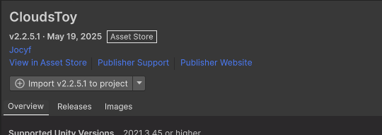

## Localisation du prefab CloudsToy Mngr 

On localise dans le dossier de l'asset le prefab CloudsToy Mngr, qui se trouve ici :
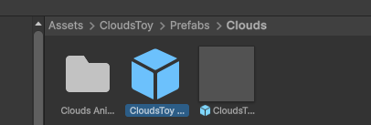

## Déposer le prefab sur la scène

On dépose le prefab dans la scène, on constate qu'il se trouve bien dans la hiérarchie mais il est invisible. Car il a besoin d'un terrain pour s'aligner. Nous allons donc par la suite créé un terrain : 
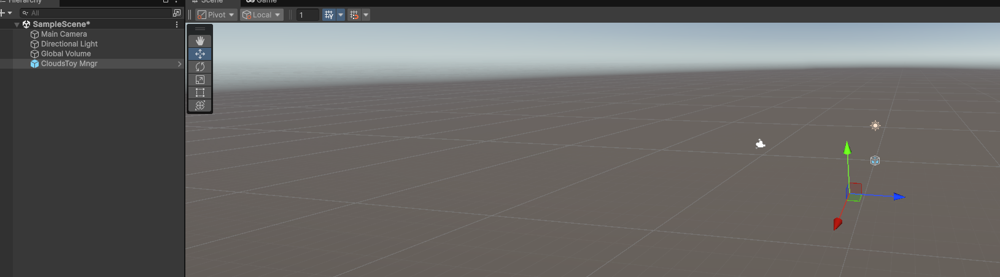

## Ajout du terrain à la scène

On génère un terrain et on le place au pied du prefab : 
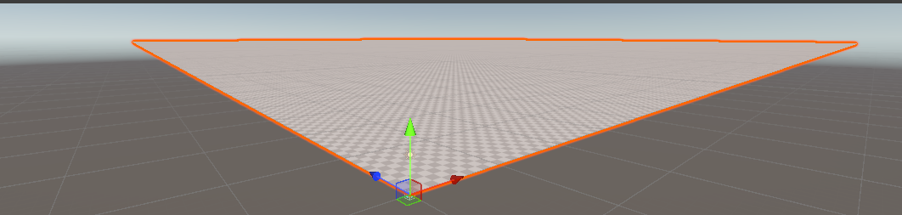

## Sculptage du terrain

On doit sculpter le terrain et le peindre. 
Voici la sculpture du terrain : 
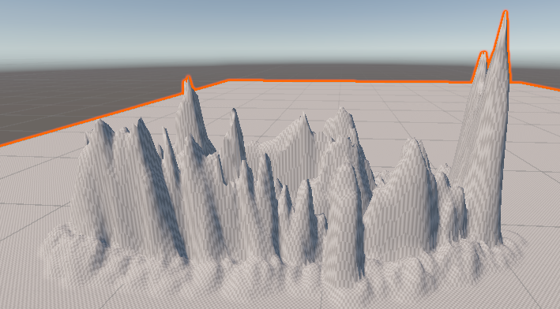

## Ajout de la lumière directionnelle

On ajoute une lumière directionnelle qui pointe vers la montagne : 

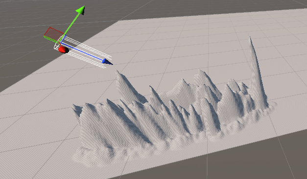

## Lancer les nuages

Après quelques soucis, nous avons rétrograder la version de unity à la 2022, et utiliser un autre terrain prégénéré proposé par le package CloudsToy, voici le placement :
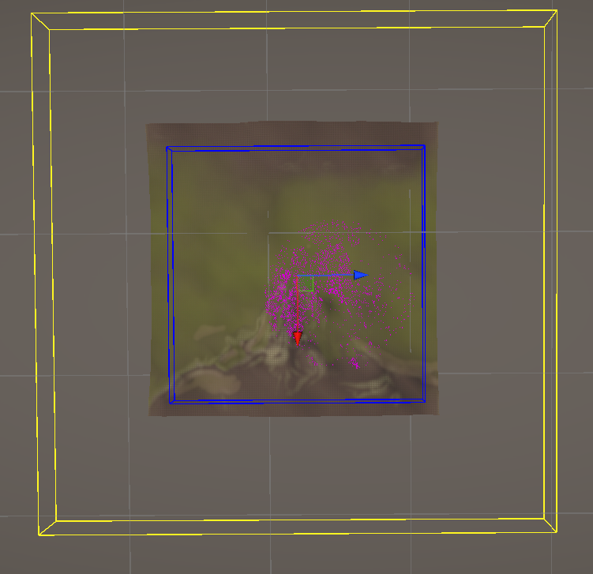

Et donc voici le résultat final : 
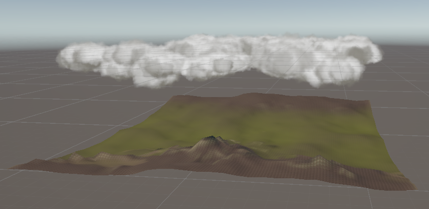

## Ajout du PFC

On ajoute un PFC basique avec un script de mouvement et de rotation, voici ce qu'on voit lorsqu'on est sur le terrain : 
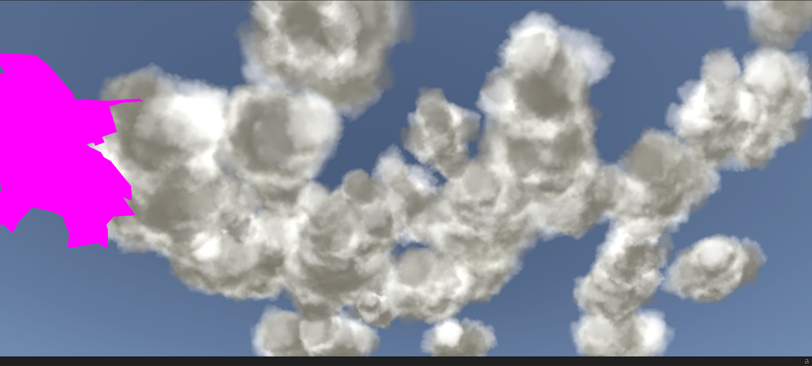

On constate que lorsque le PFC se déplace, les nuages se génèrent automatiquement, cela augmente considérablement les performances dans un jeu, on peut imaginer.

Ca raisonne sous forme de chunks, qui se chargent et se décharge en fonction du déplacement du joueur.

## Abaisser les nuages

En abaissant le nuage au niveau de la partie montagneuse de notre terrain, on peut faire en sorte que le joueur puisse se déplacer à travers les nuages, rendant l'expérience plus immersive (utile pour notre jeu)
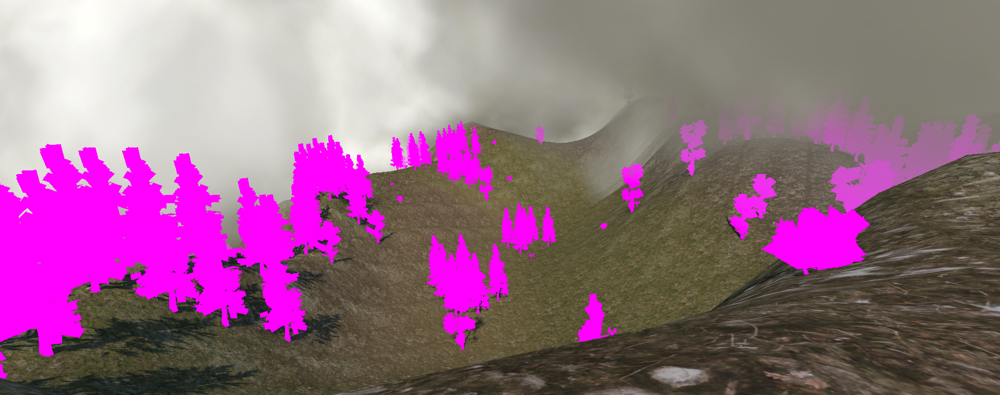

Note sur les paramètres à modifier : 
Velocity mul pour la vitesse de défilement
Soft clouds réalise une projection orthographique
Clouds Num ajoute de l'abondance sur une certaine densité de nuages
Disappear mul permet de changer la taille du rectangle jaune (la zone jaune délimite là où les nuages vont disparaître)
On peut changer la couleur des nuages 
Maximum velocity permet de faire changer la direction et la vitesse (vitesse négative = direction opposée sur l'axe considéré)
Animation velocity permet de changer la vitesse d'animation de chaque nuage 

Après avoir changé ses différents paramètres pour expérimenté, voici le résultat que l'on souhaiterait implémenter dans notre jeu au milieu du mont fuji (d'autres nuages ambiants seront là sur le ciel) : 
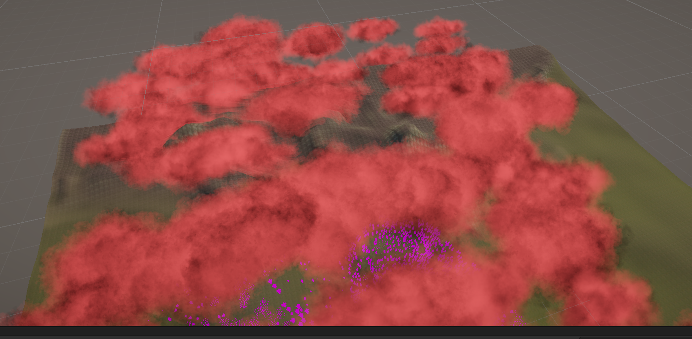

## Questions

### Principes de base des nuages volumétriques

#### Expliquez comment les nuages volumétriques sont générés dans les moteurs de jeu comme Unity. Quelles sont les différences clés entre les nuages volumétriques et les techniques traditionnelles de représentation des nuages ?

Un nuage volumétrique est un volume 3D rempli de particules, ou de voxels selon le type de génération. Caractétirsé par une couleur, une luminosité, des animations, un champ de génération, une forme, et une texture 2D.
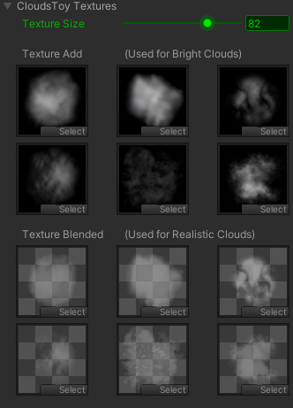

Voici par exemple les textures utilisées pour la génération des nuages par CloudsToy. Ces textures permettent de créer des volumes, un nuage, qui ensuite est répliqué de façon Random pour créer pleins de nuages volumétriques, créant la dimension de profondeur et du réalisme. Pour obtenir la forme naturelle, ils utilisent du bruit procédural, comme le bruit de perlin qu'on a vu précédemment. Lors du rendu, on a aussi du ray marching qui est appliqué, en effet, on le constate grâce à notre lumière ambiante, la lumière traverse les nuages, pour donner un aspect lumineux et moelleux.

Les différentes clés entre ces nuages et les nuages traditionels, sont dans un premier temps le réalisme. En effet, les nuages traditionnels sont plutôt 2D, peu divers et variés, donnent souvent une illusion de 3D, jouent sur le paramètre alpha du rgba pour créé de la transparence. Là où les nuages volumétriques utilisent des volumes 3D réels, diffusent la lumière entrante, utilisent des rayons pour le rendu de volume et peuvent s'animer (tourner sur eux-mêmes comme dans l'exemple étudié).
En revanche évidemment, un nuage volumétrique sera plus couteux pour le GPU que le nuage traditionnel, en raison du nombre de paramètres et du rendu complexe d'une telle forme.

#### Comment mettriez-vous en œuvre une base simple de nuages volumétriques dans Unity, en utilisant les shaders et le bruit de Perlin ? Décrivez les étapes et les composants principaux nécessaires.

En s'inspirant de CloudsToy, on peut imaginer la modélisation suivante : 
- Un cube 3D qui délimiterait l'apparission des nuages
- Le shader serait un shader volumétrique, gérant le rendu de volume, du ray marching, et la couleur du nuage
- On peut générer avec le bruit de perlin, en controllant les paramètres comme l'échelle du bruit, l'intensité ou encore l'animation
- Un script C# qui ferait varier les paramètres pour l'animation, l'éclairage, la densité, la hauteur maximale

### Réalisme et optimisation

#### Quels sont les principaux défis techniques et artistiques à surmonter pour créer des nuages volumétriques réalistes et performants dans un jeu vidéo développé avec Unity ?

Les principaux défis techniques à surmonter pour créer des nuages volumétriques sont des défis de performances. Les nuages volumétriques utilisent du ray marching qui est couteux pour le GPU.
Rendre chaque pixel est aussi couteux, étant donné qu'on a un volume 3D où chaque pixel est paramétré.

Aussi, pour simuler un éclairage réaliste, ne pas juste mettre des nuages sur le ciel. C'est-à-dire d'avoir la bonne diffusion, les bonnes ombres portées, afin de ne pas perturber l'expérience de jeu. Cela ajoute beaucoup de calculs en temps réels lorsque le joueur se déplace, à prendre en compte

En ce qui concerne les défis artistiques, il faut trouver la bonne forme de nuages pour avoir un aspect réaliste, mimant la réalité. Si les détails sont trop fins on part sur de l'artificiel, si pas assez on retourne sur des nuages trop traditionels.

Adapter les nuages aux différentes conditions, soleil, pluie etc. 

## Interaction avec l'éclairage et l'environnement

#### Comment les nuages volumétriques interagissent-ils avec les systèmes d'éclairage dynamique dans Unity ? Discutez de l'importance de cette interaction pour l'immersion et le réalisme de l'environnement de jeu

Etant donné que les nuages volumétriques sont des volumes 3D, ils intéragissent pour chaque voxel, a une densité, qui change la lumière donnée. Plus un nuage a une densité élevée, plus la lumière est attenuée. On parle dès lors de scattering, la lumière se disperse au sein du nuage, les bords deviennent lumineux, des ombres apparaissent.
L'atténuation de la lumière projetée est dès lors calculée au sein du nuage.

Le rayon lumineux entre sur une densité dS, il est atténué et arrive jusqu'au joueur. Ce qui change l'environnement.

C'est important pour l'immersion et le réalisme de l'environnement de jeu car cela améliore le réalisme visuel, ajoute un certain traitement à la lumière, créé l'atmosphère, ajoute de la profondeur, et fait réagir l'environnement.

#### Implémentez un système dans Unity où les nuages volumétriques changent d'apparence en fonction de l'heure du jour, en réagissant à la position et à la couleur de la lumière solaire. Quelles techniques utiliseriez-vous pour réaliser cela ?

/

### Effets météorologiques dynamiques

#### Quel rôle les nuages volumétriques jouent-ils dans la simulation d'effets météorologiques dynamiques dans les jeux vidéo ? Comment peuvent-ils améliorer l'expérience du joueur ?

Les nuages volumétriques sont essentiels à la simulatio nd'effets météorologiques dynamiques, car on peut faire varier les nuages pour créé des météos différentes (sachant qu'ils jouent sur la lumière comme vu précédemment) : 
- Nuages élevés et fins -> du beau temps
- Nuages épais et bas -> ciel couvert

Pour la météo : 
- Pluie : nuages sombres, grisatres
- Neige : nuages blancs, bas et froids

#### Concevez un système météorologique dynamique basique dans Unity où les nuages volumétriques évoluent en fonction des conditions météorologiques changeantes. Comment assureriez-vous la transition fluide entre différents types de temps 

/

### Art et direction visuelle

#### En termes d'art et de direction visuelle, comment les nuages volumétriques peuvent-ils être utilisés pour soutenir la narration ou l'atmosphère d'un jeu vidéo ?

Un jeu comme Minecraft prend un atmosphère clair, pour les moments de visibilité. La nuit signifie que des monstres vont apparaître, le joueur adapte son gameplay en fonction du temps qu'il fait. 

Des nuages déchirés avec des rayons de lumière peuvent par exemple simulé l'espoir, la révélation ou bien la renaissance.